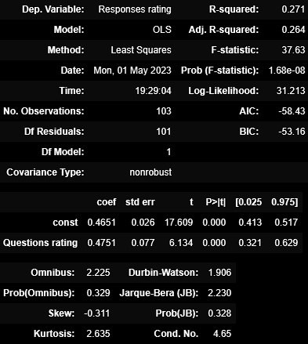

# SentimentAnalysis
## 🛈 Background Information
Sentiment analysis is a branch of natural language processing that involves determining the sentiment - or emotional tone - expressed in a piece of text. It aims to classify the sentiment as positive, negative, or neutral. Originating in the early 2000s, sentiment analysis has evolved with advancements in machine learning and linguistic techniques, enabling applications in various domains such as social media monitoring, customer feedback analysis, and brand reputation management.

The NBA Finals is a prestigous event which crowns the best professional basketball team in the world on a yearly basis. With this prestige comes pressure filled moments, emotional turmoil, and lots of interviews to capture it all! Let's take one of basketball's biggest stars, Lebron James, and perform sentiment analysis on his interviews during each of his trips to the NBA Finals. 

Lebron James has made 10 seperate Finals appearances. This is a man who competed in 8 consecutive NBA Finals; we are talking about greatness here! Not only is he one of the greatest players of all time, he is viewed as one of the greatest role models as well. An activist, entrepreneur, father, and above all, a human being, LeBron James has been in the spotlight since his mid-teenage years, serving as a shining example for all who observe him.

## 🎯 Aim
As mentioned, we aim to perform sentiment analysis on Lebron's interviews conducted during his appearances in the NBA finals. 

Our initial objective is to convert interview text from a website into clean and organized text, which will be stored in a list format using Python. This data preparation step is necessary to ensure that our data is ready to be inputted into ChatGPT, where the subsequent sentiment analysis will be carried out.

Following the analysis, we must identify the most appropriate feature which influences Lebron's response tone. We will utilize this feature to perform linear regression.

When examining tone, it is essential to acknowledge the presence of numerous influential factors. Through feature selection we aim to find the most impactful features and use these to perform multivariate regression analysis.

After conducting the regression analysis, we will assess the outcomes and subsequently further our understanding by transforming these results into binary classification.

Lastly, we will perform all of the aforementioned mentioned techniques again, but first removing interviews from practice days. This will help in comprehending the variation in our models' predictions caused by these interviews.

## :robot: ChatGPT
Prompt testing was initially performed on openai's website. We found most consistent results when submitting batches of 5 questions/responses. After a consistent return from our prompt, we integrated ChatGPT into Python and identified the tone of over 2,000 questions and responses. 

Prompt: "Let 1 = positive, 0 = neutral, and -1 = negative. Identify the tone of the 5 questions using the given values. Output the list of values in order of the questions."

Originally an f-string was used to auto generate the number of questions (as we send batches of 5, but inevitably are left with a 'remainder' group ranging in size of 1-5). However, this led to an increase in token usage. To address this, we implemented a while loop to send the prompt that matched the number of questions. Overall, ChatGPT performed well only returning an error on 3 of the over 100 interviews submitted. 

## :mag_right: Interview Source
http://www.asapsports.com/show_player.php?id=13888

## :triangular_ruler: Skills and Methods
**Web Scraping** - We conducted web scraping using the bs4 library, utilizing encoding detectors to identify all the links on the page. The BeautifulSoup package was employed to extract the text from the selected links. Leveraging my understanding of website tags, I targeted specific text elements, scraping 'i', 'h3', and 'td' tags to account for the varied formatting, given that some of these interviews date back over 15 years. Additionally, I extracted the headers from each page to identify the date and interview type (game or practice).  

**Text Cleaning** - Once we aggregate the text from each interview we are ready to begin processing our data. We split the interviews into question and response groups by identifying each line of a question begins with 'Q.'. Then cleaned each group of text and checked that every interview had the same number of questions as responses. Now the groups were ready to be fed into ChatGPT. 

**Prompt Engineering** - Engaging with ChatGPT at a surface level is a pleasurable and user-friendly experience. However, fully harnessing the vast potential of AI requires thoughtful consideration when formulating prompts. Through meticulous development and refinement, we employed first-order logic, identified optimal word choices, instruction length, and formatting techniques to elicit nearly seamless responses from our AI bot. 

**DataFrame Creation** - We collect and coallate the responses from ChatGPT into data frames in Python and then convert the results into meaningful statistics. These statistics are 'Response rating' and 'Question rating' and are defined by summing the results from chatGPT then dividing by the total number of responses or questions. We have now quantified the overall tone of each interview. Next, we must identify potential factors in determining Lebron's tone in these interviews. Data was collected and formatted for the following columns: interview length, practice, game, win, loss, home, away, series result, cumulative wins, and cumulative losses. (note: Game statistics were not collected since practice day interviews were included- where no such data would exist.)

**Regression Analysis** - SKLearn is our choice of library for linear and multivariate regression analysis. We begin by performing linear regression on 'Response rating' and 'Question rating', where we interpret the correlation coefficient ($R^2$) and our weights. In our pursuit of stronger results, we conducted feature selection on the complete set of available features to identify the most impactful ones. Through an iterative process, we ensured that only the essential features remained. As an additional validation step, we employed the f_regression technique to check the selected features' relevance and contribution. After performing feature selection, we split our data into separate training and testing sets. For accurate comparisons, we normalized the data to mitigate any scaling discrepancies. We thoroughly examined the distributions of both the train and test groups, ensuring their suitability for analysis. Finally, we interpreted the results obtained from the analysis, identifying potential areas for improvement and further refinement in our approach.

## :children_crossing: Walkthrough 
To initiate the sentiment analysis process, our first step involves collecting and organizing the data. This entails web scraping the desired interviews and subsequently cleaning and separating the transcripts into questions and responses. Save this data as a Json file, so the program does not have to webscrape every time. As we proceed we must ensure proper grouping for responses, so that our number of questions and responses agree. This check is located in our get_qandr function (under clean and sort transcript-line 15). 

Now we are ready to feed our text data into ChatGPT for sentiment analysis! We have already discussed our prompt for ChatGPT above and had success on all except three interviews. We must convert over 2000 entries consisting of only -1,0, and 1 into meaningful statistics. For all responses of an individual interview, we defined 'Response rating' to be equal to $\displaystyle\frac{sum(\text{response tone})}{len(\text{responses})}$ and similarly for 'Question rating'. We observe existence of a linear relationship between these two variables and a mostly normal distribution for our dependent variable ('Response rating'). 

  

Proceeding to our first form of regression analysis, Linear regression. For a complex variable like response tone we cannot expect one feature to describe it effectively, thus we must be reasonable in the interpretation of our results. These results are determined to be below the acceptable standard, but we have begun the path to more substantial results. 

 

For our analysis we have no need to limit our independent variables to only one. We begin to expand our data set to include more information; data was collected and formatted for the following columns: interview length, practice, game, win, loss, home, away, series result, cumulative wins, and cumulative losses. We decided to eliminate the 'Question rating' variable as it was complex, and would not be immediately available when utilizing for predictions in the future. Now we may begin the feature selection process. Iterating through selected features until finding our strongest combination. 

  

## :closed_book: Conclusion
We initiated the sentiment analysis process on Lebron James' NBA Finals interviews by leveraging the capabilities of ChatGPT. We then created variables 'response rating' and 'question rating' which summed the response/question tones (values of -1, 0, 1 assigned by ChatGPT) for each interview and divided by the total number of responses/questions. Since each of these features exhibits linearity, we conducted linear regression analysis, which yielded an $R^2$ value of .271. However, this value falls below the desired range, indicating a suboptimal fit.

Subsequently, we proceed to identify and incorporate additional features with the aim of enhancing our correlation coefficient and ultimately improving the accuracy on our test data. After recognizing that 'question rating' is a complex feature and is partly explained by other features, we make the decision to exclude it from our analysis. Our features with the strongest relationship to Lebron James' response rating were 'cumulative wins', 'cumulative losses', 'win', and 'loss'. This combination obtained an adjusted $R^2$ score of .419, a substantial improvement over the linear variation and  proves to be a satisfactory value when examining information within the realm of social sciences. A Durbin-Watson score of 2.125 implies we are safe from autocorrelation, and an F-statistic of 19.38 is large enough to imply that our model is of significance. 

Utilizing multivariate regressional analysis on test data we obtained an average residual of 0.06. When converting this data into binary classification we obtained an accuracy score of 80.95%. Lastly, we performed the same analysis on the data excluding practice interviews and reached an accuracy score of 90.90% (correctly predicting 10 of the 11 data points). Further validating our intuition that the data would be "too predictable" without the practice interviews.

Overall, we are satisfied with the results and knowledge gained by performing this sentiment analysis. Our regression analysis identified valuable features in identifying the tone of Lebron's response and quantified the strength of their relationship. Most importantly, the multivariate regression performed considerably well when predicting the tone based on minimal information. 

## :construction: Improvements
A clear improvement for most studies is obtaining more data and this is the case for ours as well. Additionally, ChatGPT 4.0 has been released and would most likely offer improved analysis and reduced errors in responses. 

It would be interesting to analyze and compare the results by year, or even by wins and losses. We could zoom in specifically on the 2011 Finals, a performance that many point to as James' largest blemish of his career.
